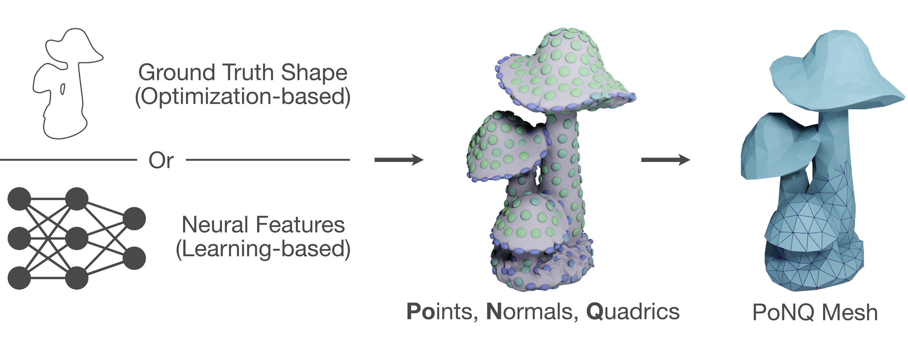

# PoNQ: a Neural QEM-based Mesh Representation [CVPR 2024]

[Nissim Maruani](https://nissmar.github.io)<sup>1</sup>, [Maks Ovsjanikov](https://www.lix.polytechnique.fr/~maks/)<sup>2</sup>, [Pierre Alliez](https://team.inria.fr/titane/pierre-alliez/)<sup>1</sup>, [Mathieu Desbrun](https://pages.saclay.inria.fr/mathieu.desbrun/)<sup>3</sup>.

<sup>1</sup> Inria, Université Côte d’Azur &emsp; <sup>2</sup> LIX, École Polytechnique, IP Paris &emsp; <sup>2</sup> Inria Saclay, École Polytechnique



Please see our [project page](https://nissmar.github.io/projects/ponq) for more results. 


## Requirements


The code is tested on the listed versions but other versions may also work:

- Python 3.9
- [PyTorch 1.12.1](https://pytorch.org/get-started/locally/)
- [PyTorch3D 0.7.0](https://github.com/facebookresearch/pytorch3d/blob/main/INSTALL.md)
- [trimesh 3.15.5](https://trimsh.org/install.html)
- igl 2.2.1
- tqdm 4.64.1
- yaml 0.2.5
- scikit-learn 0.19.3

## Demos

Several demos notebooks are available in `src/utils`
### `demo_learning`: Iso-surfacing of SDF grids
Our PoNQ model pre-trained on ABC can be used as an alternative to Marching Cubes on groundtruth Signed Distance Fields (SDF) grids. 

### `demo_learning_large`: Iso-surfacing of large SDF grids
Same as above but with a splitting 

### `TODO`

OTHER NOTEBOOKS


## Evaluation

MESHES: [Meshes](https://drive.google.com/file/d/1zk0mr8Gmx_d-yYFSC9lhMZDwTwvPujEK/view?usp=sharing)
DATA: [ABC](https://drive.google.com/file/d/1XgHf70Xqxraidhsd3RwXHw7_nifUgVSy/view?usp=sharing) and [Thingi](https://drive.google.com/file/d/1uNYQ7ZuLNqTQJPK7Rs8PiJf7sn5MhqZY/view?usp=sharing)
Generate meshes on both Thingi32 and ABC for PoNQ and PoNQ-lite with our pre-trained network:

```
mkdir out 
python src/generate_all_CNN.py configs/eval_cnn.yaml 
python src/generate_all_CNN.py configs/eval_cnn.yaml -subd 1
```

Compute various metrics (CD, F1, NC, ECD, EF1):

```
python src/eval/eval_all.py configs/eval_cnn.yaml
python src/eval/eval_all.py configs/eval_cnn.yaml -subd 1
```

Check watertightness and count mesh elements: 

````
python src/eval/check_watertight.py FOLDER
````


## Direct Optimization

Direct optimization on Thingi32:
````
python src/utils/direct.py configs/direct_thingi.yaml -grid_n 32
python src/utils/direct.py configs/direct_thingi.yaml -grid_n 64
python src/utils/direct.py configs/direct_thingi.yaml -grid_n 128
````

Compute various metrics (CD, F1, NC, ECD, EF1):

````
python src/eval/eval_THINGI.py FOLDER
````


## Model training

### Data preparation
Follow the instructions provided by [NMC](https://github.com/czq142857/NMC/tree/main/data_preprocessing) to:
- Download the first chunk of ABC
- run `simplify_obj.py`
- compile `SDFGen`

After that, run `get_data.py` to obtain SDF grids, sampled points and sample normals for training
### Training
Run each one of the training phase, and do not forget to rename `model.pt`between each one.

```
cd learning
python src/utils/train_cnn_multiple_quadrics_split.py configs/abc_cnn_multiple_quadrics_split_1.yaml
python src/utils/train_cnn_multiple_quadrics_split.py configs/abc_cnn_multiple_quadrics_split_2.yaml
python src/utils/train_cnn_multiple_quadrics_split.py configs/abc_cnn_multiple_quadrics_split_3.yaml
```

## Citation 
TODO

## Acknowledgments 
TODO